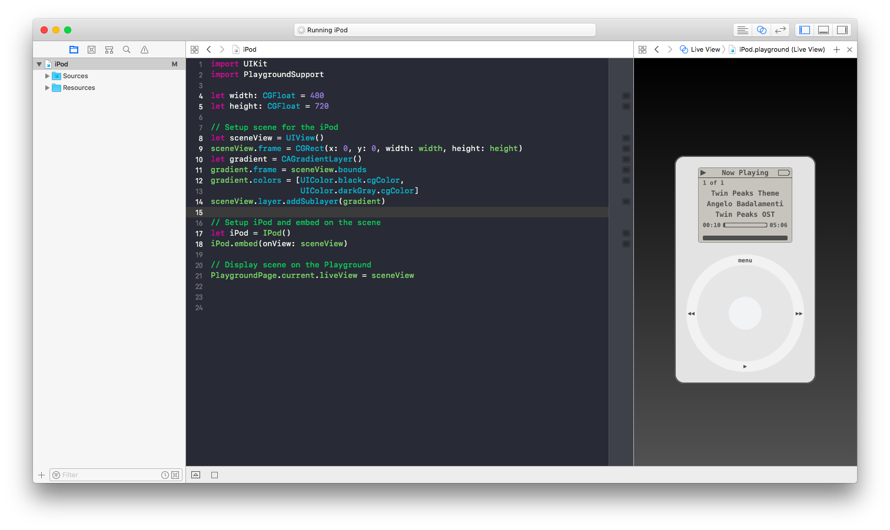

# WWDC18 Scholarship submission

    
    
    

# About

Welcome to my 2018 WWDC Scholarship submission! This is my first one, and hopefully it will be accepted so I can master my iOS skills on the conference! Wish me luck.

This playground simulates the original 2001 iPod. It is able to play music and browse through the library smoothly. The inspiration was the fact that my very first Apple product was 4th gen iPod Touch, and it was the device that got me into iOS programming. I simply fell in love in the operating system and how it all just works! (Plus I just really love the iPod device family <3)

# Usage

1. Clone repository
2. Open the playground file with Xcode
3. Drag some of your favourite music into the `Resources` directory
4. Enjoy the iPod experience
